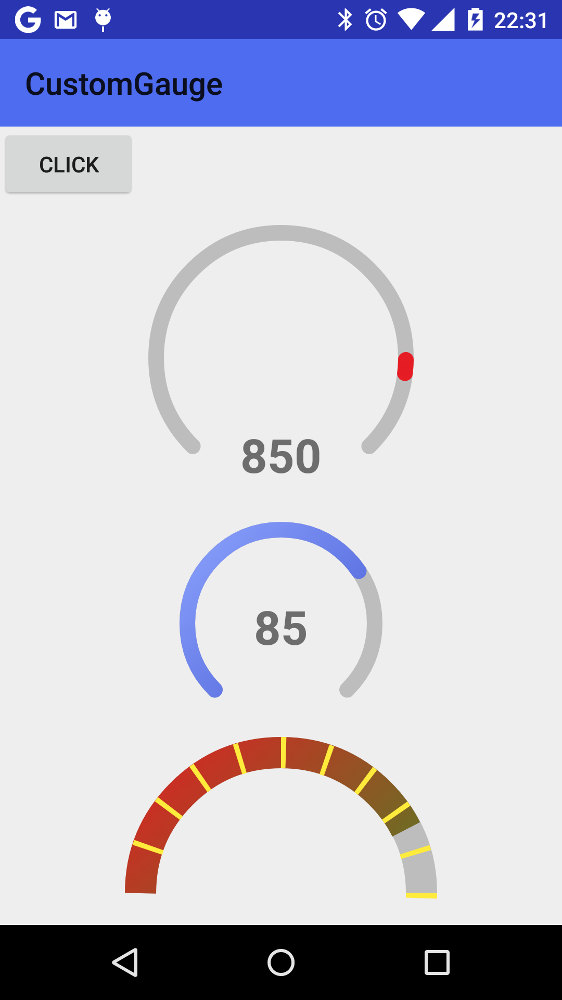

CustomGauge
===========

Simple gauge view

&nbsp;

### Installation

 * Add the following to your <code>build.gradle</code>:

<pre>repositories {
    jcenter()
}

dependencies {
    compile 'pl.pawelkleczkowski.customgauge:CustomGauge:1.0.2'
}</pre>

 * Add "pl.pawelkleczkowski.customgauge.CustomGauge" view in your layout (example below)
 * Find CustomGauge view in your activity and use methods "setValue()" and "getValue()" to manage view

### Attributes

Available view attributes:

 * startAngel (left start angel in degrees) - please be informed that gauge is drawn as an arc from startAngel (where to start) with sweepAngel (how many degrees arc is); what is more it's clockwise (right - 0, bottom - 90, left - 180, top - 270 degrees); if for example you want full circle start on 90 with 360 sweepAngel
 * sweepAngel - as described above
 * startValue - scale start value
 * endValue - scale end value
 * strokeWidth - stroke width
 * strokeColor - resource color (cannot be selector)
 * strokeCap - style of circle stroke (BUTT - straight, ROUND - rounded)
 * pointSize - defined for pointer drawn on current value (first example) - tells how wide pointer should be; if not set pointer is drawn from start value to current value (like second example)
 * pointStartColor - used for gradient pointer (second example)
 * pointEndColor - used for gradient pointer (second example)
 * dividerSize - size of divider related to values; if declared dividers will be drawn(!); e.g. if your start value is 50 and end value is 120 dividerSize set to 2 means that divider will have 1/35 of gauge total width - in other words it will have size of 2 points of gauge scale
 * dividerStep - tells how often dividers will be drawn; it's in percentage values(!); e.g. if you want to have dividers drawn each 20% of scale just set it to 20 and you will have 6 dividers drawn (with first and last)
 * dividerColor - color of divider
 * dividerDrawFirst - whether to draw first divider or no
 * dividerDrawLast - whether to draw last divider or no

### Example

    
    <pl.pawelkleczkowski.customgauge.CustomGauge
        android:id="@+id/gauge1"
        android:layout_width="200dp"
        android:layout_height="200dp"
        android:layout_centerHorizontal="true"
        android:layout_below="@+id/button"
        android:paddingBottom="20dp"
        android:paddingLeft="20dp"
        android:paddingRight="20dp"
        android:paddingTop="20dp"
        app:gaugePointStartColor="@color/Red"
        app:gaugePointEndColor="@color/Red"
        app:gaugePointSize="6"
        app:gaugeStartAngel="135"
        app:gaugeStrokeCap="ROUND"
        app:gaugeStrokeColor="@color/Gray"
        app:gaugeStrokeWidth="10dp"
        app:gaugeStartValue="0"
        app:gaugeEndValue="1000"
        app:gaugeSweepAngel="270" />

    <pl.pawelkleczkowski.customgauge.CustomGauge
        android:id="@+id/gauge2"
        android:layout_width="140dp"
        android:layout_height="140dp"
        android:layout_below="@+id/gauge1"
        android:layout_centerHorizontal="true"
        android:paddingBottom="10dp"
        android:paddingLeft="10dp"
        android:paddingRight="10dp"
        android:paddingTop="10dp"
        app:gaugeEndValue="800"
        app:gaugePointEndColor="@color/DarkBlue"
        app:gaugePointStartColor="@color/LightSkyBlue"
        app:gaugeStartAngel="135"
        app:gaugeStartValue="200"
        app:gaugeStrokeCap="ROUND"
        app:gaugeStrokeColor="@color/Gray"
        app:gaugeStrokeWidth="10dp"
        app:gaugeSweepAngel="270" />

&nbsp;

### License

GNU General Public License, version 2