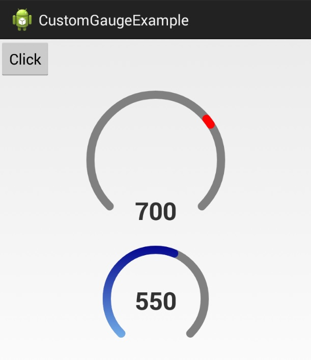

CustomGauge
===========

Simple gauge view

&nbsp;

### Installation

 * Import "CustomGauge" as a library into your project
 * Add "pl.pawelkleczkowski.customgauge.CustomGauge" view in your layout (example below)
 * Find CustomGauge view in your activity and use methods "setValue()" and "getValue()" to manage view

### Attributes

Available view attributes:
 * startAngel (left start angel in degrees) - please be informed that gauge is drawn as an arc from startAngel (where to start) with sweepAngel (how many degrees arc is); what is more it's clockwise (right - 0, bottom - 90, left - 180, top - 270 degrees); if for example you want full circle start on 90 with 360 sweepAngel
 * sweepAngel - as described above
 * startValue - scale start value
 * endValue - scale end value
 * strokeWidth - stroke width
 * strokeColor - resource color (cannot be selector)
 * strokeCap - style of circle stroke (BUTT - straight, ROUND - rounded)
 * pointSize - defined for pointer drawn on current value (upper example) - tells how wide pointer should be; if not set pointer is drawn from start value to current value (like lower example)
 * pointStartColor - used for gradient pointer (lower example)
 * pointEndColor - used for gradient pointer (lower example)

### Example

    
    <pl.pawelkleczkowski.customgauge.CustomGauge
        android:id="@+id/gauge1"
        android:layout_width="200dp"
        android:layout_height="200dp"
        android:layout_centerHorizontal="true"
        android:layout_below="@+id/button"
        android:paddingBottom="20dp"
        android:paddingLeft="20dp"
        android:paddingRight="20dp"
        android:paddingTop="20dp"
        gauge:pointStartColor="@color/Red"
        gauge:pointEndColor="@color/Red"
        gauge:pointSize="6"
        gauge:startAngel="135"
        gauge:strokeCap="ROUND"
        gauge:strokeColor="@color/Gray"
        gauge:strokeWidth="10dp"
        gauge:startValue="0"
        gauge:endValue="1000"    
        gauge:sweepAngel="270" />

    <pl.pawelkleczkowski.customgauge.CustomGauge
        android:id="@+id/gauge2"
        android:layout_width="140dp"
        android:layout_height="140dp"
        android:layout_below="@+id/gauge1"
        android:layout_centerHorizontal="true"
        android:paddingBottom="10dp"
        android:paddingLeft="10dp"
        android:paddingRight="10dp"
        android:paddingTop="10dp"
        gauge:endValue="800"
        gauge:pointEndColor="@color/DarkBlue"
        gauge:pointStartColor="@color/LightSkyBlue"
        gauge:startAngel="135"
        gauge:startValue="200"
        gauge:strokeCap="ROUND"
        gauge:strokeColor="@color/Gray"
        gauge:strokeWidth="10dp"
        gauge:sweepAngel="270" />
